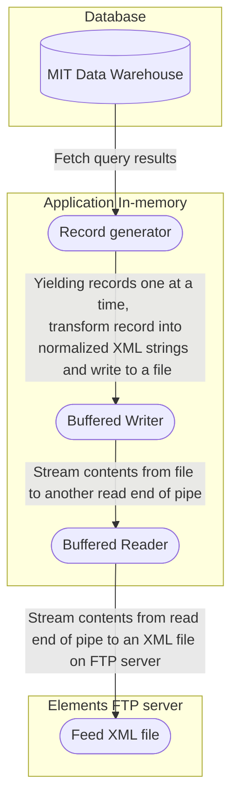

# Carbon

Carbon is a tool for loading data into [Symplectic Elements](https://support.symplectic.co.uk/support/solutions/articles/6000049890-symplectic-elements-quick-start-guide). Carbon retrieves records from the Data Warehouse, normalizes and writes the data to XML files, and uploads the XML files to the Elements FTP server. It is used to create and run the following feed types: 

   * `people`: Provides data for the HR Feed.
   * `articles`: Provides data for the Publications Feed.

Please refer to the [mitlib-tf-workloads-carbon](https://github.com/mitlibraries/mitlib-tf-workloads-carbon) for the deployment configuration.

For more information on the Carbon application, please refer to our [internal documentation on Confluence](https://mitlibraries.atlassian.net/l/cp/1E6cMvuT).

## Data flow

This flowchart depicts the data flow from MIT's Data Warehouse to the application's in-memory buffered streams and to the final location of the output file, an XML file on the Elements FTP server.




## Development

* To install with dev dependencies: `make install`
* To update dependencies: `make update`
* To lint the repo: `make lint`

The Data Warehouse runs on an older version of Oracle that necessitates the `thick` mode of `python-oracledb`, which requires the Oracle Instant Client Library (this app was developed with version 21.9.0.0.0).

### Running the test suite

The test suite uses SQLite, so you can develop and test without connecting to the Data Warehouse.

1. Run `make test` to run unit tests.

### Running the application on your local machine

1. Export AWS credentials for the `Dev1` environment. For local runs, the `AWS_DEFAULT_REGION` environmnet variable must also be set.

2. Create a `.env` file at the root folder of the Carbon repo, and set the required environment variables described in [Required Env](#required-env).

   **Note**: The host for the Data Warehouse is different when connecting from outside of AWS (which uses Cloudconnector). For assistance, reach out to the [Data Warehouse team](https://ist.mit.edu/warehouse).

3. Connect to an approved [VPN client](https://ist.mit.edu/vpn). 

4. Follow the steps relevant to the machine you are running:
   * If you are on a machine that cannot run Oracle Instant Client, follow the steps outlined in [With Docker](#with-docker). When running the application locally, skip the step to run `make publish-dev` as it is not necessary to publish the container to ECR. 

      **Note**: As of this writing, Apple M1 Macs cannot run Oracle Instant Client.
   * If you are on a machine that can run Oracle Instant Client, follow the steps outlined in [Without Docker](#without-docker).

The data retrieved by the Carbon application contains personally identifiable information (PII), so downloading the files is not recommended. However, if examining the files created by Carbon is **absolutely necessary** for testing purposes, this can be done on your local machine via a Docker container. For more information, please refer to the Confluence document: [How to download files from an application that connects to the Data Warehouse](https://mitlibraries.atlassian.net/wiki/spaces/~712020c6fcb37f39c94e54a6bfd09607f29eb4/pages/3469443097/Running+applications+in+a+local+Docker+Container).

**Note:** Any downloaded files or `.env` files must be **immediately deleted** after testing is complete.

#### With Docker

1. Run `make dependencies` to download the Oracle Instant Client from S3.

2. Run `make dist-dev` to build the Docker container image.

3. Run `make publish-dev` to push the Docker container image to ECR for the `Dev1` environment. 

4. Run any `make` commands for testing the application. In the Makefile, the names of relevant make commands will contain the suffix '-with-docker'.


#### Without Docker

1. Download [Oracle Instant Client](https://www.oracle.com/database/technologies/instant-client/downloads.html) (basiclite is sufficient) and set the `ORACLE_LIB_DIR` env variable.

2. Run any `make` commands for testing the application. In the Makefile, the names of relevant make commands will contain the suffix '-with-docker'.

### Running the application as an ECS task

The application can be run as an ECS task. Any runs that require a connection to the Data Warehouse must be executed as a task in the `Stage-Workloads` environment because Cloudconnector is not enabled in `Dev1`. This requires building and publishing the Docker container image to ECR for `Stage-Workloads`.

1. Export AWS credentials for the `stage` environment. The `ECR_NAME_STAGE` and `ECR_URL_STAGE` environment variables must also be set. The values correspond to the 'Repository name' and 'URI' indicated on ECR for the container image, respectively.

2. Run `make dist-stage` to build the Docker container image.

3. Run `make publish-stage` to push the Docker container image to ECR for the `stage` environment.

4. Run any `make` commands for testing the application. In the Makefile, the names of relevant make commands will contain the suffix '-with-ecs-stage' (e.g. `run-connection-tests-with-ecs-stage`).

For an example, see [Connecting to the Data Warehouse](#connecting-to-the-data-warehouse).

## Deploying

In the AWS Organization, we have a automated pipeline from `Dev1` --> `Stage-Workloads` --> `Prod-Workloads`, handled by GitHub Actions.

### Staging

When a PR is merged onto the `main` branch, Github Actions will build a new container image. The container image will be tagged with "latest" and the shortened commit hash (the commit that merges the PR to `main`). The tagged image is then uploaded to the ECR repository in `Stage-Workloads`. An EventBridge scheduled event will periodically trigger the Fargate task to run. This task will use the latest image from the ECR registry.

### Production

Tagging a release on the `main` branch will promote a copy of the `latest` container from `Stage-Workloads` to `Prod-Workloads`.

## Connecting to the Data Warehouse

The password for the Data Warehouse is updated each year. To verify that the updated password works, run the connection tests for Carbon. Carbon will run connection tests for the Data Warehouse and the Elements FTP server when executed with the flag `--run_connection_tests`. 

1. Export AWS credentials for the `stage` environment. The `ECR_NAME_STAGE` and `ECR_URL_STAGE` environment variables must also be set. The values correspond to the 'Repository name' and 'URI' indicated on ECR for the container image, respectively.
2. Run `make install`.
3. Run `make run-connection-tests-with-ecs-stage`.
4. View the logs from the ECS task run on CloudWatch.
   * On CloudWatch, select the `carbon-ecs-stage` log group.
   * Select the most recent log stream.
   * Verify that the following log is included:
      > Successfully connected to the Data Warehouse: \<VERSION NUMBER\>

## Required ENV

```
WORKSPACE= "dev"

# type of feed, either "people" or "articles"
FEED_TYPE="people"

# JSON formatted string of key/value pairs for the MIT Data Warehouse connection
DATAWAREHOUSE_CLOUDCONNECTOR_JSON='{"USER": "<VALID_DATAWAREHOUSE_USERNAME>", "PASSWORD": "<VALID_DATAWAREHOUSE_PASSWORD>", "HOST": "<VALID_DATAWAREHOUSE_HOST>", "PORT": "<VALID_DATAWAREHOUSE_PORT>", "PATH": "<VALID_DATAWAREHOUSE_ORACLE_SID>", "CONNECTION_STRING": "<VALID_DATAWAREHOUSE_CONNECTION_STRING>"}'

# A JSON formatted string of key/value pairs for connecting to the Symplectic Elements FTP server
SYMPLECTIC_FTP_JSON='{"SYMPLECTIC_FTP_HOST": "<VALID_ELEMENTS_FTP_HOST>", "SYMPLECTIC_FTP_PORT": "<VALID_ELEMENTS_FTP_PORT>", "SYMPLECTIC_FTP_USER": "<VALID_ELEMENTS_FTP_USER>", "SYMPLECTIC_FTP_PASS": "<VALID_ELEMENTS_FTP_PASSWORD>"}'

# full XML file path that is uploaded to the Symplectic Elements FTP server
SYMPLECTIC_FTP_PATH="<FTP_FILE_DIRECTORY>/people.xml"

# SNS topic ARN used for sending email notifications.
SNS_TOPIC="<VALID_SNS_TOPIC_ARN>"
```

## Optional ENV

* `LOG_LEVEL` = The log level for the `carbon` application. Defaults to `INFO` if not set.
* `ORACLE_LIB_DIR` = The directory containing the Oracle Instant Client library.
* `SENTRY_DSN` = If set to a valid Sentry DSN, enables Sentry exception monitoring. This is not needed for local development.